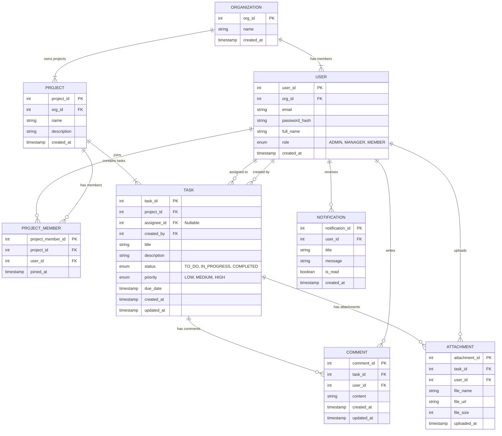

# Entity Relationship Diagram (ERD)

The diagram below describes the database structure of the **RFX Project Management** system, including the main entities: Organization, User, Project, Task, Comment, Attachment, and Notification.

---

## Database Schema

---

## Entity Descriptions

### 1. **ORGANIZATION**
Represents a company or organization using the system.

| Field | Type | Description |
|-------|------|-------------|
| `org_id` | int (PK) | Unique organization identifier |
| `name` | string | Organization name |
| `created_at` | timestamp | Creation timestamp |

---

### 2. **USER**
Represents users within an organization.

| Field | Type | Description |
|-------|------|-------------|
| `user_id` | int (PK) | Unique user identifier |
| `org_id` | int (FK) | References organization |
| `email` | string | User email address |
| `password_hash` | string | Hashed password |
| `full_name` | string | User's full name |
| `role` | enum | User role: ADMIN, MANAGER, MEMBER |
| `created_at` | timestamp | Account creation timestamp |

---

### 3. **PROJECT**
Represents projects within an organization.

| Field | Type | Description |
|-------|------|-------------|
| `project_id` | int (PK) | Unique project identifier |
| `org_id` | int (FK) | References organization |
| `name` | string | Project name |
| `description` | string | Project description |
| `created_at` | timestamp | Project creation timestamp |

---

### 4. **PROJECT_MEMBER**
Junction table linking users to projects (many-to-many relationship).

| Field | Type | Description |
|-------|------|-------------|
| `project_member_id` | int (PK) | Unique identifier |
| `project_id` | int (FK) | References project |
| `user_id` | int (FK) | References user |
| `joined_at` | timestamp | Date user joined project |

---

### 5. **TASK**
Represents individual tasks within projects.

| Field | Type | Description |
|-------|------|-------------|
| `task_id` | int (PK) | Unique task identifier |
| `project_id` | int (FK) | References project |
| `assignee_id` | int (FK) | References assigned user (nullable) |
| `created_by` | int (FK) | References user who created task |
| `title` | string | Task title |
| `description` | string | Task description |
| `status` | enum | TO_DO, IN_PROGRESS, COMPLETED |
| `priority` | enum | LOW, MEDIUM, HIGH |
| `due_date` | timestamp | Task deadline |
| `created_at` | timestamp | Task creation timestamp |
| `updated_at` | timestamp | Last update timestamp |

---

### 6. **COMMENT**
Represents comments on tasks.

| Field | Type | Description |
|-------|------|-------------|
| `comment_id` | int (PK) | Unique comment identifier |
| `task_id` | int (FK) | References task |
| `user_id` | int (FK) | References commenting user |
| `content` | string | Comment text |
| `created_at` | timestamp | Comment creation timestamp |
| `updated_at` | timestamp | Last update timestamp |

---

### 7. **ATTACHMENT**
Represents files attached to tasks.

| Field | Type | Description |
|-------|------|-------------|
| `attachment_id` | int (PK) | Unique attachment identifier |
| `task_id` | int (FK) | References task |
| `user_id` | int (FK) | References uploading user |
| `file_name` | string | Original filename |
| `file_url` | string | File storage location/URL |
| `file_size` | int | File size in bytes |
| `uploaded_at` | timestamp | Upload timestamp |

---

### 8. **NOTIFICATION**
Represents user notifications.

| Field | Type | Description |
|-------|------|-------------|
| `notification_id` | int (PK) | Unique notification identifier |
| `user_id` | int (FK) | References recipient user |
| `title` | string | Notification title |
| `message` | string | Notification message content |
| `is_read` | boolean | Read status flag |
| `created_at` | timestamp | Notification creation timestamp |

---

## Relationship Summary

- **ORGANIZATION** owns multiple **PROJECTS** and has multiple **USERS**
- **USERS** can join multiple **PROJECTS** through **PROJECT_MEMBER** (many-to-many)
- **PROJECTS** contain multiple **TASKS**
- **TASKS** can be assigned to **USERS** and are created by **USERS**
- **TASKS** can have multiple **COMMENTS** and **ATTACHMENTS**
- **USERS** write **COMMENTS** and upload **ATTACHMENTS**
- **USERS** receive **NOTIFICATIONS**

---

## Notes

- Foreign keys (FK) establish relationships between entities
- Primary keys (PK) uniquely identify records
- Enum fields have predefined valid values
- Nullable fields (like `assignee_id`) allow for unassigned tasks
- Timestamps track entity creation and modification times