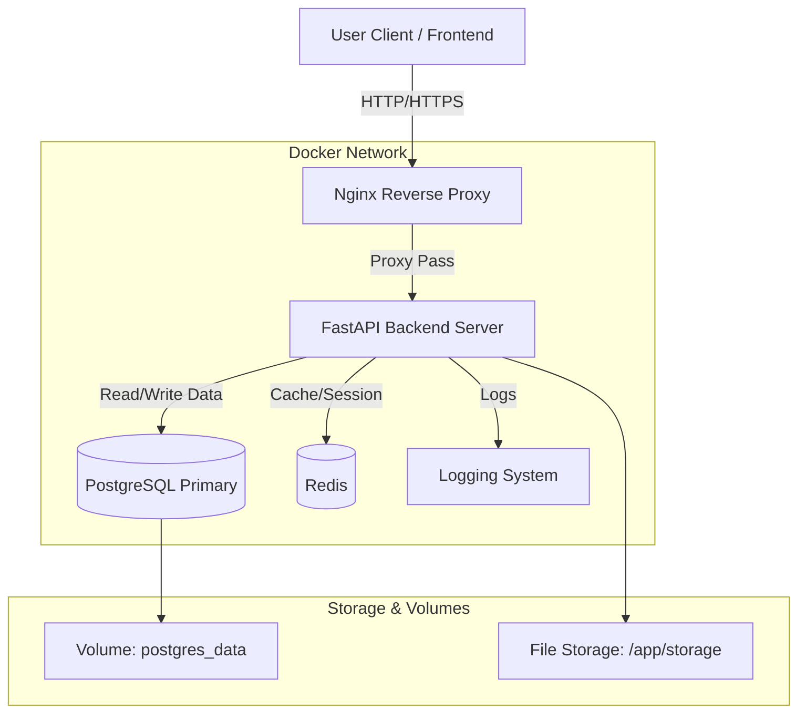
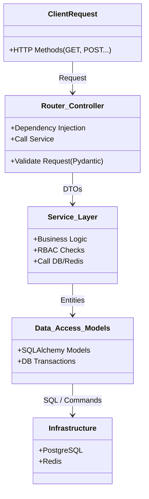
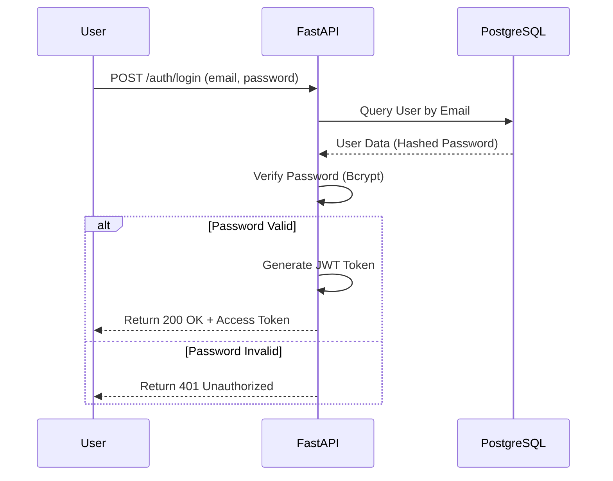
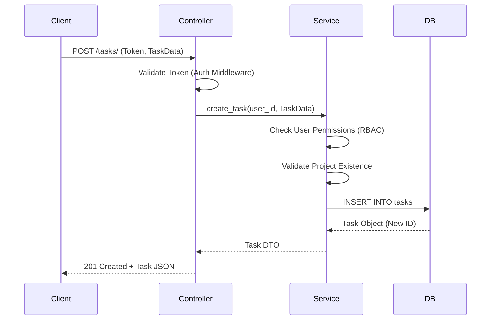

# System Design Documentation - RFX Project Management System

## 1. Overview

**RFX Project Management System** is a Backend project management solution built on asynchronous technology platform, focusing on high performance and scalability. The system provides features for managing organizations, projects, tasks, and progress reporting.

---

## 2. High-Level Architecture

The system is fully containerized in **Docker**, using a Microservices-ready model with **Nginx** as a Reverse Proxy routing requests to Backend, Database, and Cache.

---

## 3. Tech Stack & Components

| Component | Technology | Description |
|-----------|-----------|-------------|
| Language | Python 3.11+ | Utilizing modern Type Hinting and Async I/O |
| Web Framework | FastAPI | High-performance framework with automatic OpenAPI support |
| Database | PostgreSQL 15 | Robust relational database using asyncpg driver |
| ORM | SQLAlchemy (Async) | Object Relational Mapper |
| Migrations | Alembic | Database schema migration management |
| Caching | Redis | Cache storage, session management, and Rate Limiting support |
| Testing | Pytest | Automated testing framework (Unit & Integration Test) |
| Container | Docker & Compose | Consistent deployment environment packaging |
| Web Server | Nginx | Reverse Proxy and Static Files serving |

---

## 4. Layered Architecture

Source code is organized following the **Controller - Service - Repository** pattern to ensure "Separation of Concerns" principle.

### 4.1. Main Modules

- **API Layer** (`app/api`): Receives requests, validates input data (Pydantic Schemas), and returns standardized responses
- **Service Layer** (`app/services`): Contains core business logic (e.g., report calculations, file upload processing, task creation logic)
- **Model Layer** (`app/models`): Defines database table structure using SQLAlchemy
- **Core** (`app/core`): System configuration, Security, Logging, and Redis connection

---

## 5. Main Processing Flows (Sequence Diagrams)

### 5.1. Login Flow

Describes how users log in and receive JWT Access Token.

### 5.2. Create Task Flow

Describes the interaction between layers when a user creates a new task.

---

## 6. Security Design

### 6.1. Authentication

- **Standard**: OAuth2 with Password Flow
- **Token**: JSON Web Tokens (JWT) containing `sub` (user_id) and `role`
- **Encryption**: Passwords are hashed using bcrypt algorithm before storing in DB

### 6.2. Authorization (RBAC)

The system implements Role-Based Access Control:

- **ADMIN**: Full system administration rights, manages Organizations and Projects
- **MANAGER**: Manages projects, adds members, and assigns tasks within their organization
- **MEMBER**: Can only view assigned projects and update status of assigned tasks

---

